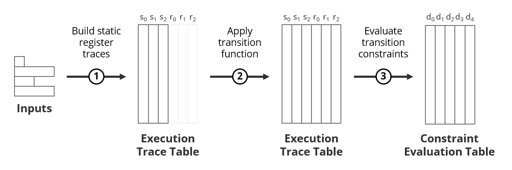

`version 0.3`

# AirAssembly

AirAssembly is a low-level language for encoding Algebraic Intermediate Representation (AIR) of computations. The goal of the language is to provide a minimal number of constructs required to fully express AIR for arbitrary computations.

AirAssembly is intended to be a compilation target for higher-level languages, and as such, expressivity and readability by humans are not explicit goals of the language. Instead, the language aims to:

1. Be compact and easy to parse. This is one of the reasons AirAssembly uses [s-expression](https://en.wikipedia.org/wiki/S-expression)-based syntax.
2. Provide a small number of primitives which can be combined together to form more complex constructs.
3. Avoid redundancy and implicit behavior. Ideally, there should be one right way to do things, and all parameters should be specified explicitly.

## AirAssembly module
A module in AirAssembly is a self-contained unit which fully describes a set of computations. Its purpose is to specify:

1. Inputs required by the computations.
2. Logic for generating execution traces for the computations.
3. Logic for evaluating transition constraints for the computations.
4. Metadata needed to compose the computations with other computations.

Module expression has the following form:
```
(module
    <field declaration>
    <constant declarations>
    <function declarations>
    <component exports>)
```

The code below illustrates AirAssembly module structure on an example of a [MiMC](https://vitalik.ca/general/2018/07/21/starks_part_3.html#mimc) computation:
```
(module
    (field prime 340282366920938463463374607393113505793)
    (const $alpha scalar 3)
    (function $mimcRound
        (result vector 1)
        (param $state vector 1) (param $roundKey scalar)
        (add 
            (exp (load.param $state) (load.const $alpha))
            (load.param $roundKey)))
    (export mimc
        (registers 1) (constraints 1) (steps 1024)
        (static
            (cycle (prng sha256 0x4d694d43 64)))
        (init
            (param $seed vector 1)
            (load.param $seed))
        (transition
            (call $mimcRound (load.trace 0) (get (load.static 0) 0)))
        (evaluation
            (sub
                (load.trace 1)
                (call $mimcRound (load.trace 0) (get (load.static 0) 0))))))
```

The meaning of sections in the above example is as follows:

* [Field declaration](#Field-declaration) specifies the finite field to be used for all arithmetic operations within the module.
* [Constant declarations](#Constant-declarations) define a set of constants which can be used in arithmetic operations within the module.
* [Function declarations](#Function-declarations) define a set of functions which can be used to encapsulate common arithmetic expressions.
* [Component exports](#Component-exports) define a set of computations exported by the module. Each component consists of the following sub-sections:
  * [Signature](#Component-signature) defines basic properties of the computation (number of registers, number of constraints etc.).
  * [Static registers](#Static-registers) describe logic for building static registers, including logic for non-scalar interpreting inputs.
  * [Trace initializer](#Trace-initializer) describes logic for initializing the first row of the execution trace, including logic for interpreting scalar inputs.
  * [Transition function](#Transition-function) describes state transition logic for the computation.
  * [Constraint evaluator](#Constraint-evaluator) describes algebraic relation between steps of the computation.

## Execution model
Executing a component of an AirAssembly module against a set of inputs produces two outputs:

1. Execution trace table
2. Constraint evaluation table

**Execution trace table** is a two-dimensional matrix in which each column corresponds to a state register, and each row contains values for the registers at a given step of a computation. The columns in the execution trace table can be partitioned into 2 types:

1. Static register traces - these are generated by transforming inputs according to static register specifications.
2. Dynamic register traces - these are generated by iteratively applying a transition function for each step of the computation.

**Constraint evaluation table** is also a two-dimensional matrix. But in this case, each column corresponds to a transition constraint polynomial, and each row contains values resulting from evaluating constraint polynomials at a given point of the evaluation domain.

AirAssembly module execution process is illustrated in the picture below:



1. First, the static segment of the execution trace table is built by evaluating static register specifications against provided inputs.
2. Then, the dynamic segment of the execution trace table is built by evaluating the transition function for each step of the computation.
    * The dynamic segment is built after the static segment because transition function should be able to access static registers at every step.
    * Before transition function starts executing, a trace initializer is invoked to generate values for the first row of the trace table.
3. Finally, the constraint evaluation table is built by applying constraint evaluator to the extended execution trace.

(the funny shape of the Inputs drawing is not accidental; check out [nested input register](#Nested-input-registers) example to see why).

## Module sections
The sections below provide detailed explanation of [AirAssembly module](#AirAssembly-module) sections.

### Field declaration
Field declaration section specifies a finite field to be used in all arithmetic expressions. The declaration expression has the following form:
```
(field <type> <modulus>)
```
where:
* `type` specifies the type of the field. Currently, only `prime` fields are supported.
* `modulus` specifies prime field modulus.

For example:
```
(field prime 340282366920938463463374607393113505793)
```
The above example defines a prime field with modulus = 2<sup>128</sup> - 9 * 2<sup>32</sup> + 1.

### Constant declarations
Constant declaration section defines a set of constants which can be used in arithmetic operations within the module. A constant declaration expression has the following form:
```
(const <handle?> <value>)
```
where:
* `handle` is an optional name which can be used to reference the constant. If the handle is not provided, a constant can be referenced by its index (zero-based, in the order of declaration). A handle must start with `$` character followed by a letter, and can contain any combination of letters, numbers, and underscores.
* `value` is the value of a constant which can be a scalar, a vector, or a matrix (see [value types](#Value-types) for more info).

For example:
```
(const scalar 5)              # declares scalar constant with value 5
(const vector 1 2 3 4)        # declares vector constant with values [1, 2, 3, 4]
(const matrix (1 2) (3 4))    # declares matrix constant with rows [1, 2] and [3, 4]
```
Once defined, values of constants cannot be changed. To reference a constant in an [arithmetic expression](#Arithmetic-expressions) `load.const` operation can be used (see [load operations](#Load-operations) for more info).

### Function declarations
Function declaration section defines a set of module functions which can be used to encapsulate common arithmetic expressions. A module function is a pure mathematical function which takes a set of parameters, performs arithmetic operations with these parameters, and outputs the result. A function declaration has the following form:
```
(function <handle?> <result> <params> <locals?> <body>)
```
where:
* `handle` is an optional name which can be used to reference the function. If the handle is not provided, a function can be referenced by its index (zero-based, in the order of declaration). A handle must start with `$` character followed by a letter, and can contain any combination of letters, numbers, and underscores.
* `result` declares the return type of the function, which has the form: `(result <type>)`, where `type` can be either a scalar, a vector, or a matrix (see [value types](#Value-types) for more info). For non-scalar types, additional info must be supplied to specify the dimensions of the function return value.
* `params` section declares a set of one ore more [parameters](#Function-parameters) expected by the function.
* `locals` section declares a set of zero or more [local variables](#Function-local-variables) which can be used within the function body.
* `body` section consists of a set of arithmetic expressions which define [function evaluation logic](#Function-body).

For example:
```
(function $mimcRound
    (result vector 1)
    (param $state vector 1) (param $roundKey scalar)
    (add 
        (exp (load.param $state) (scalar 3))
        (load.param $roundKey)))
```
The above code declares a function with the following properties:
* The handle of the function is `$mimcRound`;
* The function returns a vector of length 1;
* The function expects 2 parameters: a vector of length 1 (`$state`) and a scalar (`$roundKey`);
* The body of the function performs the following computation: `$state`<sup>3</sup> + `$roundKey`.

If we call this function with parameters `$state = [3]` and `$roundKey = 33`, the function will return a vector `[60]`.

To invoke a function, a `call` operation can be used (see [function calls](#Function-calls) for more info). A function can call other functions, but only if these functions have already been declared. Thus, recursive or circular function calls are not possible.

#### Function parameters
Params section of a function declares parameters which are expected by the function. Parameter declaration expression has the following form:
```
(param <handle?> <type>)
```
where:
* `handle` is an optional name which can be used to reference the parameter. If the handle is not provided, a parameter can be referenced by its index (zero-based, in the order of declaration). A handle must start with `$` character followed by a letter, and can contain any combination of letters, numbers, and underscores.
* Parameter `type` can be either a scalar, a vector, or a matrix (see [value types](#Value-types) for more info). For non-scalar types, additional info must be supplied to specify the dimensions of the parameter.

For example:
```
(param $foo scalar)     # declares a scalar parameter with handle $foo
(param vector 4)        # declares a vector parameter with length 4
(param matrix 2 4)      # declares a matrix parameter with 2 rows and 4 columns
```
To read a value of a function parameters from within the function body, `load.param` operation can be used (see [load operations](#Load-operations) for more info). It is not possible to modify a value of a function parameter (parameters are immutable).

#### Function local variables
Locals section of a function declares variables which can be used in the function body. Variable declaration expression has the following form:
```
(local <handle?> <type>)
```
where:
* `handle` is an optional name which can be used to reference the variable. If the handle is not provided, a variable can be referenced by its index (zero-based, in the order of declaration). A handle must start with `$` character followed by a letter, and can contain any combination of letters, numbers, and underscores.
* Variable `type` can be either a scalar, a vector, or a matrix (see [value types](#Value-types) for more info). For non-scalar types, additional info must be supplied to specify the dimensions of the variable.

For example:
```
(local $foo scalar)     # declares a scalar variable with handle $foo
(local vector 4)        # declares a vector variable with length 4
(local matrix 2 4)      # declares a matrix variable with 2 rows and 4 columns
```

To write a value into a local variable `store.local` operation can be used. To read a value of a local variable `load.local` operation can be used. See [store operations](#Store-operations) and [load operations](#Load-operations) for more info.

#### Function body
A function body consists of a list of [arithmetic expressions](#Arithmetic-expressions) such that:

1. All expressions in the list, except the last one, must be [store operations](#Store-operations) which write the result of some arithmetic expression into a local variable.
2. The last expression in the list must evaluate to a value which matches the return type of the function as specified by the `result` expression.

For example, the body of the function below consists of a single expression:
```
(vector (add (scalar 1) (scalar 2)))    # resolves to vector [3]
```
Another example, where a local variable is used to store value of a common sub-expression:
```
(store 0 (add (scalar 1) (scalar 2)))   # stores value 3 into local variable 0
(vector (load.local 0) (load.local 0))  # resolves to vector [3, 3]
```

### Component exports
Component exports section defines a set of computations exported from the module. Each exported component defines a single computation, and a module can export one or more components. A component declaration has the following form:
```
(export <name>
    <signature>
    <static registers?>
    <initializer>
    <transition function>
    <constraint evaluator>)
```
where:
* `name` specifies the name under which the component is exported. The name must start with a letter and can contain any combination of letters, numbers, and underscores.
* [Signature](#Component-signature) defines basic properties of the computation.
* [Static registers](#Static-registers) describe logic for building static registers, including logic for interpreting non-scalar inputs.
* [Trace initializer](#Trace-initializer) describes logic for initializing the first row of the execution trace, including logic for interpreting scalar inputs.
* [Transition function](#Transition-function) describes state transition logic for the computation.
* [Constraint evaluator](#Constraint-evaluator) describes algebraic relation between steps of the computation.

For example:
```
(export mimc
    (registers 1) (constraints 1) (steps 1024)
    (static
        (cycle (prng sha256 0x4d694d43 64)))
    (init
        (param $seed vector 1)
        (load.param $seed))
    (transition
        (call $mimcRound (load.trace 0) (get (load.static 0) 0)))
    (evaluation
        (sub
            (load.trace 1)
            (call $mimcRound (load.trace 0) (get (load.static 0) 0)))))
```
The above code defines a single component which describes a MiMC computation. The defined computation has the following properties:
* The computation takes `1024` steps to execute.
* The computation requires a single static register. The trace of this register is built by repeating a sequence of `64` pseudo-randomly generated values.
* The execution trace has a single dynamic register. This register is initialized to the value passed into the trace initializer as a parameter.
* The transition function resolves to the value returned from the `$mimcRound` function. The call to the function is made by passing execution trace row at current step as the first parameter, and the value of the static register as the second parameter.
* The computation requires a single constraint. This constraint is computed by subtracting the result of the transition function from the next state of the computation.

#### Component signature
Component signature section defines basic properties of a computation described by the component and has the following form:
```
(registers <registers>) (constraints <constraints>) (steps <steps>)
```
where:
* `registers` specifies the number of dynamic registers in the execution trace. The value must be an integer between `1` and `256`.
* `constraints` specifies the number of transition constraints. The value must be an integer between `1` and `1024`.
* `steps` specifies minimum cycle length of the computation. The value must be an integer greater than `1` which is a power of `2`.

#### Static registers
Static registers section defines logic for generating static register traces. These traces are computed before the execution of the transition function, and cannot be changed by the transition function or the constraint evaluator. Static section expression has the following form:
```
(static <input registers> <mask registers> <cyclic registers>)
```
where:
* `input registers` is a list of zero or more [input register](#Input-registers) declarations;
* `mask registers` is a list of zero or more [mask register](#Mask-registers) declarations;
* `cyclic registers` is a list of zero or more [cyclic register](#Cyclic-registers) declarations.

For example, the following code block declares 3 registers - one of each type:
```
(static
    (input public (steps 8))
    (mask (input 0))
    (cycle 1 2 3 4))
```
A detailed explanation of each type of static register is provided in the following sections.

##### Input registers
Input register declarations define a set of non-scalar inputs required by the computation, and describes the logic needed to transform these inputs into register traces. Input register declaration expression has the following form:
```
(input <scope> <binary?> <master?> <steps?> <shift?>)
```
where:
* `scope` can be either `secret` or `public`. Values for `secret` input registers are assumed to be known only to the prover and need to be provided only at the proof generation time. Values for `public` input registers must be known to both, the prover and the verifier, and must be provided at the time of proof generation, as well as, at the time of proof verification.
* An optional `binary` attribute indicates whether the input register accepts only binary values (ones and zeros).
* An optional reference to a master registers of the form: `(<relation> <index>)`, where:
  * `relation` can be either `peerof` or `childof`, and defines relation between this register and its master register. This allows forming of nested inputs (see [examples](#Nested-input-registers) for more info).
  * `index` is the index of the master register.
* `steps` expression has the form `(steps <count>)`, where `count` specifies the number of steps by which a register trace should be expanded for each input value. The number of steps must be a power of 2. `steps` expression can be provided only for "leaf" input registers (see [examples](#Nested-input-registers) for more info).
* An optional `shift` expression specifies the number of steps by which an input value should be shifted in the execution trace. The expression has the form `(shift <steps>)`, where `steps` is a signed integer indicating the number of steps to shift by (see [examples](#Single-input-register) for more info).

Detailed examples of how different types of input registers are transformed into register traces are available [here](#Input-register-trace-generation), but here are a few simple examples of input register declarations:
```
(input public (steps 8))
(input secret (shift -1))
(input public binary (childof 1) (steps 8))
```

##### Mask registers
Mask registers are static registers that replace ("mask") values in an input register. Mask register declaration has the following form:
```
(mask <inverted?> (input <register>))
```
where:
* An optional `inverted` attribute specifies whether the mask should be inverted (see below).
* `register` is an index of an input register which should be masked.

For example, the code block below declares an input register and two mask registers, one of which is an inverted mask register:
```
(input public vector (steps 4))
(mask (input 0))
(mask inverted (input 0))
```
If we provide [1, 2, 3, 4] as input values for the first register, traces for the registers will look like so:
```
register 0: [1, 0, 0, 0, 2, 0, 0, 0, 3, 0, 0, 0, 4, 0, 0, 0]    # input register
register 1: [1, 0, 0, 0, 1, 0, 0, 0, 1, 0, 0, 0, 1, 0, 0, 0]    # mask
register 2: [0, 1, 1, 1, 0, 1, 1, 1, 0, 1, 1, 1, 0, 1, 1, 1]    # inverted mask
```

##### Cyclic registers
Cyclic register are static registers that repeat a pre-defined pattern of values over an execution trace. Cyclic register declaration has the following form:
```
(cycle <values | prng expression>)
```
where:
* `values` is the list of scalars which form the basis of the register trace. The list must contain at least 2 value, and the length of the list must be a power of 2.
* `prng expression` is an expression which describes how a sequence of values can be generated pseudo-randomly from a given seed (see [here](#Prng-expression) for more info).

For example, the following code block declares two cyclic registers:
```
(cycle 1 2 3 4)
(cycle 1 1 0 0 0 0 1 1)
```
If the trace length is equal to 16 steps, register traces for these registers will look like so:
```
register 0: [1, 2, 3, 4, 1, 2, 3, 4, 1, 2, 3, 4, 1, 2, 3, 4]
register 1: [1, 1, 0, 0, 0, 0, 1, 1, 1, 1, 0, 0, 0, 0, 1, 1]
```

###### Prng expression
Prng expression provides a succinct way to specify a sequence of pseudo-random values derived from a given seed. The expression has the following form:
```
(prng <method> <seed> <count>)
```
where:
* `method` specifies how the `seed` is used to generate the pseudo-random sequence. Currently, the only allowed method is `sha256`.
* `seed` is a hexadecimal value of the seed for PRNG at most 20 bytes long.
* `count` is the number of values to generate. `count` must be an integer between `1` and `32768` and must be a power of 2.

For example, the code below will generate a sequence of 64 values:
```
(prng sha256 0x4d694d43 64)
```
The values are generated by applying SHA256 hash function to a combination of the seed and a value's index, and then reducing the resulting value by the field's modulus. A value's index is represented by a 2-byte unsigned integer, and is appended to the front of the seed. For example, for the above expression, the values will be generated as follows:
```
[
    sha256(0x00014d694d43) % field.modulus,
    sha256(0x00024d694d43) % field.modulus,
    sha256(0x00034d694d43) % field.modulus,
    ...
    sha256(0x00404d694d43) % field.modulus
]
```

#### Trace initializer
Trace initializer section describes the logic needed to generate the first row of the execution trace. That is, the the value returned by the initializer becomes the first row of the execution trace (row `0`). Trace initializer expression has the following form:
```
(init <param?> <locals?> <body>)
```
where:
* `param` is an optional parameter which can be passed to the initializer. The parameter expression is the same as for [function parameters](#Function-parameters) with the restriction that an initializer can accept only a single parameter and the type of the parameter must be a vector.
* `locals` section declares a set of zero or more local variables similar to [function locals](#Function-local-variables).
* `body` section consists of a set of arithmetic expressions similar to [function bodies](#Function-body) but with the following differences:
  * Body of a trace initializer must always resolve to a vector. The length of the vector must equal to the number of dynamic registers as specified in the [component signature](#Component-signature).
  * Unlike module functions, trace initializers have access to static register traces. These can be accessed by using `load.static` operation (see [load operations](#Load-operations) for more info).

The initializer is executed before the [transition function](#Transition-function) is run (but after static register traces have been generated). Thus, the current step for the initializer is one before step `0` of the execution trace. This is interpreted as the last step of the execution trace (rather than step `-1` which does not exist).

For example, the following initializer will set the first row of the execution trace to the last value of static register `0`.
```
(init
    (slice (load.static 0) 0 0)
```
As mentioned above, the initializer can also accept a single parameter, and use this parameter to initialize the first row of the execution trace. For example:
```
(init
    (param $seed vector 1)
    (vector (load.param $seed) (scalar 0)))
```
 This initializer sets the first row of the execution trace to a vector of two values: the first value is the passed in parameter, and the second value is a scalar `0`.

#### Transition function
Transition function describes state transition logic needed to generate dynamic register traces. That is, the value returned by the transition function becomes the next row in the execution trace table. Transition function expression has the following form:
```
(transition <locals?> <body>)
```
where:
* `locals` section declares a set of zero or more local variables similar to [function locals](#Function-local-variables).
* `body` section consists of a set of arithmetic expressions similar to [function bodies](#Function-body) but with the following differences:
  * Body of a transition function must always resolve to a vector. The length of the vector must equal to the number of dynamic registers as specified in the [component signature](#Component-signature).
  * Unlike module functions, transition functions have access to the already generated rows of the execution trace table. These rows can be accessed with `load.trace` and `load.static` operations (see [load operations](#Load-operations) for more info).

For example:
```
(transition
    (local scalar)                      # local variable declaration
    (store 0                            # function body starts here
        (add                        
            (get (load.trace 0) 0))     # get 1st value from current row of execution trace
            (get (load.trace 0) 1))     # get 2nd value from current row of execution trace
    (vector
        (load.local 0)                  # load value of the local variable 0
        (add
            (load.local 0)
            (get (load.trace 0) 1))))
```
The above transition function produces a trace table with 2 dynamic registers per row. The transition logic is as follows:
* At each step, the values of the first and second registers are summed, and the result is stored in the local variable `0`.
* Then this sum becomes the value of the first register for the next row,
* And the value of the second register for the next row is set to the sum plus the value of the second register.

(this is actually a somewhat convoluted way to describe a transition function for the Fibonacci sequence).

#### Constraint evaluator
Constraint evaluator section describes transition constraint evaluation logic needed to generate a constraint evaluation table for the computation. That is, the value returned from the constraint evaluator becomes the next row in the constraint evaluation table. Constraint evaluation expression has the following form:
```
(evaluation <locals?> <body>)
```
where:
* `locals` section declares a set of zero or more local variables similar to [function locals](#Function-local-variables).
* `body` section consists of a set of arithmetic expressions similar to [function bodies](#Function-body) but with the following differences:
  * Body of a constraint evaluator must always resolve to a vector. The length of the vector must equal to the number of constraints as specified in the [component signature](#Component-signature).
  * Unlike module functions, constraint evaluators have access to the future rows of the execution trace table. The table can be accessed with `load.trace` and `load.static` operations (see [load operations](#Load-operations) for more info).

The code block below shows a simple example of a constraint evaluator which complements the example of a transition function described previously.
```
(evaluation
    (local scalar)                     # local variable declaration
    (store 0                           # evaluator body starts here
        (add                        
            (get (load.trace 0) 0)) 
            (get (load.trace 0) 1))
    (sub
        (load.trace 1)                 # loads the next row the dynamic trace registers
        (vector
            (load.local 0)
            (add
                (load.local 0)
                (get (load.trace 0) 1)))))
```
The evaluator above loads the next row of the dynamic segment of the execution trace table, and subtracts the result of applying the transition function to the current row from it.

## Arithmetic expressions
Arithmetic expressions are the basic building blocks for the bodies of transition functions and transition constraint evaluators. These expressions usually perform some operation with one or more values, and resolve to a new value which is the result of the operation.

### Value types
Values in AirAssembly can be of one of the following types:

1. **Scalar** - which is a single field element.
2. **Vector** - which is a one-dimensional arrays of field elements.
3. **Matrix** - which is a two-dimensional arrays of field elements.

### Vector operations
To create a vector, the following expression can be used:
```
(vector <elements>)
```
where:
*  **elements** is a list of expressions which resolve to scalars or vectors.

For example:
```
(vector (scalar 1) (scalar 2) (scalar 3) (scalar 4))
(vector (scalar 1) (vector (scalar 2) (scalar 3)) (add (scalar 2) (scalar 2)))
```
Both of the above expressions resolve to a vector with elements `[1, 2, 3, 4]`.

#### Extracting vector element
To extract a single element from a vector, the following expression can be used:
```
(get <vector> <index>)
```
where:
 * **vector** is the vector from which the element is to be extracted,
 * **index** is the zero-based index of the element to extract.

 For example:
```
(get (vector (scalar 1) (scalar 2) (scalar 3)) 1)    # resolves to scalar value 2
```

#### Slicing vectors
To extract a slice of elements from a vector, the following expression can be used:
```
(slice <vector> <start index> <end index>)
```
where:
 * **vector** is the vector from which the elements are to be extracted,
 * **start index** is the zero-based, inclusive index of the element at which to start extraction,
 * **end index** is the zero-based, inclusive index of the element at which to end extraction.

For example:
```
(slice (vector (scalar 1) (scalar 2) (scalar 3)) 1 2)    # resolves to vector [2, 3]
(slice (vector (scalar 1) (scalar 2) (scalar 3)) 1 1)    # resolves to vector [2]
```

### Matrix operations
To create a matrix, the following expression can be used:
```
(matrix <rows>)
```
where:
 * **rows** is a list of expressions which resolve to a list of field elements or to a vector. All rows in the matrix must have the same number of columns (elements).

 For example:
 ```
 (matrix ((scalar 1) (scalar 2) (scalar 3) (scalar 4)) ((scalar 5) (scalar 6) (scalar 7) (scalar 8)))
 (matrix (vector (scalar 1) (scalar 2) (scalar 3) (scalar 4)) (vector (scalar 5) (scalar 6) (scalar 7) (scalar 8)))
 ```
Both of the above expressions resolve to a matrix with 2 rows and 4 columns containing values `[[1, 2, 3, 4], [5, 6, 7, 8]]`.

### Binary arithmetic operations
AirAssembly supports basic arithmetic operations. To perform such operations the following expression can be used:
```
(<operation> <operand 1> <operand 2>)
```
where:
* **operation** is one of the following operations:
  * `add` - modular addition.
  * `sub` - modular subtraction.
  * `mul` - modular multiplication.
  * `div` - modular division computed as modular multiplication of the first operand with the multiplicative inverse of the second operand.
  * `exp` - modular exponentiation, where the second operand (the exponent) must be a static scalar value.
  * `prod` - matrix or vector product as described [here](#prod-operation).
* **operand 1** is an expression resolving to the first operand.
* **operand 2** is an expression resolving to the second operand.

For example:
```
(add (scalar 1) (scalar 2))   # resolves to 3
(sub (scalar 3) (scalar 1))   # resolves to 2
(mul (scalar 3) (scalar 3))   # resolves to 9
(div (scalar 4) (scalar 2))   # resolves to 2
(exp (scalar 2) (scalar 8))   # resolves to 256
```
The above operations can also take vectors and matrixes as operands. In such cases, the operations are treated as **element-wise** operations and it is required that both operands have the same lengths/dimensions. For example:
```
(add (vector (scalar 1) (scalar 2)) (vector (scalar 3) (scalar 4)))     # resolves to [4, 6]
(add (vector (scalar 1) (scalar 2)) (vector (scalar 3)))                # results in an error
```
The second operand can also be replaced with a scalar value. For example:
```
(exp (vector (scalar 3) (scalar 4)) (scalar 2))       # resolves to [9, 16]
```

#### prod operation
`prod` operation can be applied only to vectors and matrixes, and types of operands define the operation performed like so:

* `(prod <matrix> <matrix>)` - performs a standard [matrix multiplication](https://en.wikipedia.org/wiki/Matrix_multiplication) of two matrixes. If the matrixes have dimensions [*n*,*p*] and [*p*,*m*] respectively, the resulting matrix will have dimensions [*n*,*m*].
* `(prod <matrix> <vector>)`- also performs matrix multiplication, but the result is a vector. If the input matrix dimensions are [*n*,*m*], and the length of the input vector is *m*, the resulting vector will have length *n*.
* `(prod <vector> <vector>)` - performs a [linear combination](https://en.wikipedia.org/wiki/Linear_combination) of two vectors. Vectors must have the same length, and the output is a scalar.

### Unary arithmetic operations
AirAssembly also supports two unary arithmetic operations. These operations are applied to a single operand like so:
```
(<operation> <operand>)
```
where:
* **operation** is one of the following operations:
  * `neg` - modular additive inverse.
  * `inv` - modular multiplicative inverse.
* **operand** is an expression resolving a scalar, a vector, or a matrix.

For example (assuming field modulus is 23):
```
(neg (scalar 21))    # resolves to 2
(inv (scalar 15))    # resolves to 20
```
If the operand is a vector or a matrix, the operation is performed **element-wise**. For example:

```
(neg (vector (scalar 1) (scalar 2) (scalar 3) (scalar 4)))  # resolves to [22, 21, 20 19]
```

### Load operations
To retrieve values from various sections of a program's memory, the following expression can be used:
```
(load.<source> <indexOrHandle>)
```
where:
* **source** specifies the memory segment; can be one of the following values:
  * `const` - array of global constants.
  * `param` - array of function parameters.
  * `local` - array of local variables.
  * `static` - static segment of the execution trace table.
  * `trace` - dynamic segment of the execution trace table.
* **indexOrHandle** specifies which value to retrieve from the specified source. The meaning of this parameter depends on the `source` parameter as follows:
  * `const` - zero-based index of a global constant, or if the constant was declared with a handle, the handle can be used instead of the index.
  * `param` - zero-based index of a parameter, or if the parameter was declared with a handle, the handle can be used instead of the index.
  * `local` - zero-based index of a local variable, or if the local variable was declared with a handle, the handle can be used instead of the index.
  * `static` - row offset into the execution trace table, with 0 being the row at the current step, 1 being the row at the next step etc.
  * `trace` - row offset into the execution trace table, with 0 being the row at the current step, 1 being the row at the next step etc.

For example:
```
(load.const 0)      # resolves to the value of the global constant at index 0
(load.const $foo)   # resolves to the value of the global constant with handle $foo
(load.param 0)      # resolves to the value of the parameter at index 0
(load.local 0)      # resolves to the value of local variable at index 0
(load.static 0)     # resolves to the static register row at the current step
(load.trace 0)      # resolves to the dynamic register row at the current step
(load.trace 1)      # resolves to the dynamic register row at the next step
(load.trace -1)     # resolves to the dynamic register row at the previous step
```

For `static` and `trace` sources, the result of a load operation is always a vector with each element of the vector corresponding to a single register. For `const`, `param`, and `local` sources, the result could be a scalar, a vector, or a matrix - depending on the declared type of a global constant, parameter, or a local variable.

Some memory segments can be accessed only from certain contexts as shown in the following table:

| Context              | const | param | local | static | trace |
| -------------------- | :---: | :---: | :---: | :----: | :---: |
| module function      | Yes   |  Yes  |  Yes  | No     | No    |
| trace initializer    | Yes   |  Yes  |  Yes  | yes    | No    |
| transition function  | Yes   |  No   |  Yes  | Yes    | Yes   |
| constraint evaluator | Yes   |  No   |  Yes  | Yes    | Yes   |

To summarize the table:
* Global constants can be accessed from any context.
* Transition functions and constraint evaluators cannot have declared parameters.
* Local variables can be declared in any context.
* Static registers cannot be accesses from module functions.
* Trace registers can be accessed only from transition functions and constraint evaluators.

**Note 1:** trying to load a value from a local variable that hasn't been initialized yet, will result in an error.

**Note 2:** transition functions can access current and past rows of the execution trace table (offsets `0`, `-1`, `-2` etc.), while constraint evaluator can access current and future rows of the execution trace table (offsets `0`, `1`, `2` etc.).

### Store operations

To update a value of a local variable, the following expression can be used:
```
(store.local <indexOrHandle> <value>)
```
* **indexOrHandle** is a zero-based position of the variable in the local variables array. If the variable was declared with a handle, the handle can be used instead of the index.
* **value** is an expression which resolves to a value to be assigned to the local variable. Type of the value must match the declared type of the local variable, otherwise an error will be thrown.

For example:
```
(store.local 0 (scalar 1))          # stores a scalar into local variable with index 0
(store.local 1 (vector 1 2 3 4))    # stores a vector into local variable with index 1
(store.local $foo (scalar 5))       $ stores a scalar into local variable with handle $foo
```

Value of a given local variable can be updated an unlimited number of times. Also, the `value` expression can contain references to the variable being updated. For example, the following is perfectly valid:
```
(store.local 0 (scalar 1))              # stores 1 into local variable 0
(store.local 0 (add 2 (load.local 0)))  # stores 3 into local variable 0
```
**Note:** unlike other expressions, store expressions do not resolve to a value, and therefore, cannot be used as sub-expressions in other expressions.

### Function calls
To invoke a [module function](#Function-declarations), the following expression can be used:
```
(call <indexOrHandle> <parameters>)
```
where:
* `indexOrHandle` is a zero-based index of the function (in the order of declaration), or if the functions was declared with a handle, the handle can be used instead of the index.
* `parameters` is a list of parameters to passed to the function.

For examples:
```
(call $mimcRound (load.trace 0) (get (load.static 0) 0))
```
The above call does the following:
* Function with handle `$mimcRound` is invoked.
* Two values are passed to the function as parameters: the first value is a vector, and the second value is a scalar.
* The expression resolves to a value returned by the function.

## Input register trace generation
Input register traces require two pieces of data to generate:

1. Input register declarations which belong to the `static` section of AirAssembly module (described [here](#Input-registers)),
2. Input values which are provided at the time of proof generation and proof verification. The inputs are expected to be provided as arrays, which can also be nested (i.g. arrays of arrays multiple layers deep).

### Single input register
The examples below illustrate how various inputs for a single register are transformed into register traces. Since we work with a single register, our traces will have only 1 column.

Let's start with a simple example of an input register that resolves to a trace of 4 steps long.
```
(input public (steps 4))
```
If the input value for this register was a array `[3]` (input value to a register must always be an array), the resulting trace column would be `[3, 0, 0, 0]`. Basically, the first value in the trace would be set to the input value, and the remaining values would be set to `0`.

If we provide more than one value as an input, the resulting traces will look like so:
* Input [3] => `[3, 0, 0, 0]`
* input [3, 4] => `[3, 0, 0, 0, 4, 0, 0, 0]`
* Input [3, 4, 5, 6] => `[3, 0, 0, 0, 4, 0, 0, 0, 5, 0, 0, 0, 6, 0, 0, 0]`

Notice, how for each input value, trace length is extended by 4 steps.

We can also change trace length by changing the number of steps. For example:
```
(input public (steps 8))
```
Given input `[3]`, this will evaluate to a column with values `[3, 0, 0, 0, 0, 0, 0, 0, 0]`.

We can also control the position at which the input values show up in the trace using a `shift` expression like so:
```
(input public (steps 4) (shift 1))
```
Now, for input [3, 4, 5, 6] the register will evaluate to a trace column with values `[0 3, 0, 0, 0, 4, 0, 0, 0, 5, 0, 0, 0, 6, 0, 0]`. Basically, the values are now rotated by 1 position to the right. It is also possible to rotate the values to the left by specifying a negative number in the shift expression.

Here are a few more examples of shifting inputs [1, 2, 3, 4] by various magnitudes:
```
no shift   => [3, 0, 0, 0, 4, 0, 0, 0, 5, 0, 0, 0, 6, 0, 0, 0]
(shift 1)  => [0, 3, 0, 0, 0, 4, 0, 0, 0, 5, 0, 0, 0, 6, 0, 0]
(shift 2)  => [0, 0, 3, 0, 0, 0, 4, 0, 0, 0, 5, 0, 0, 0, 6, 0]
(shift -1) => [0, 0, 0, 4, 0, 0, 0, 5, 0, 0, 0, 6, 0, 0, 0, 3]
(shift -2) => [0, 0, 4, 0, 0, 0, 5, 0, 0, 0, 6, 0, 0, 0, 3, 0]
```

### Multiple independent input registers
We can define multiple input registers, and in such cases the number of trace columns will equal to the number of declared registers. For example, the following code block defines two input registers. The first register expands by 4 steps for each input value, while the second register expand by 8 steps for each input value.
```
(input public (steps 4))
(input public (steps 8))
```
If we provide [3, 4, 5, 6] as inputs for the first register, and [7, 8] as inputs for the second register, the resulting column traces will look like so: 

```
register 0: [3, 0, 0, 0, 4, 0, 0, 0, 5, 0, 0, 0, 6, 0, 0, 0]
register 1: [7, 0, 0, 0, 0, 0, 0, 0, 8, 0, 0, 0, 0, 0, 0, 0]
```
Notice that both registers resolve to traces of the same length. This is required. Providing inputs that evaluate to trace columns of different lengths will result in an error.

### Nested input registers
We can also specify relationships between input registers like so:
```
(input public)
(input public (childof 0) (steps 2))
```
The above example declares 2 input registers such that:
1. The first register expects a list of values,
2. The second register expects one or more values for each value provided for the first register. This is accomplished by a `master` expression in which `(childof 0)` means that the parent of the register is register with index `0`.

For example, if we provide [3, 4] as inputs for the first register, we need to provide one or more values for each value in this list. For example, it could be [[5, 6], [7, 8]]. For this set of inputs, trace columns will look like so:
```
register 0: [3, 0, 0, 0, 4, 0, 0, 0]
register 1: [5, 0, 6, 0, 7, 0, 8, 0]
```

If, on the other hand, we keep the inputs for the first register as [3, 4], but provide [[5, 6, 7, 8], [9, 10, 11, 12]] as inputs for the second register, trace columns would look like so:
```
register 0: [3, 0, 0, 0, 0, 0, 0, 0, 4, 0,  0, 0,  0, 0,  0, 0]
register 1: [5, 0, 6, 0, 7, 0, 8, 0, 9, 0, 10, 0, 11, 0, 12, 0]
```

We can also nest register relations as deep as needed. For example, the code block below has two levels of nesting and also two parallel nesting structures:
```
(input public)
(input public (childof 0))
(input public (childof 1) (steps 2))
(input public (childof 0))
(input public (peerof 3))
(input public (childof 3) (steps 4))
```
This results in a tree-like structure where:
* Register 0 is a parent of both registers 1 and 3
* Register 1 is a parent of register 2
* Register 3 is a peer of register 4 and a parent of register 5
* Registers 2 and 5 are the "leaves" of the dependency tree.

Notice also that we didn't specify the number of steps for non-leaf registers. In general, number of steps must be specified only for the leaf registers. Specifying number of steps for non-leaf registers will result in an error.

To illustrate how inputs for such register structure are transformed into register traces, suppose we provide the following inputs for each register:
```
Register 0: [3]
Register 1: [[5, 6, 7, 8]]
Register 2: [[[9, 10], [11, 12], [13, 14], [15, 16]]]
Register 3: [[17, 18]]
Register 4: [[19, 20]]
Register 5: [[[21, 22], [23, 24]]]
```
The register traces generated for this set of inputs would look like so:
```
register 0: [3,  0,  0,  0,  0,  0,  0,  0,  0,  0,  0,  0,  0,  0,  0,  0]
register 1: [5,  0,  0,  0,  6,  0,  0,  0,  7,  0,  0,  0,  8,  0,  0,  0]
register 2: [9,  0, 10,  0, 11,  0, 12,  0, 13,  0, 14,  0, 15,  0, 16,  0]
register 3: [17, 0,  0,  0,  0,  0,  0,  0, 18,  0,  0,  0,  0,  0,  0,  0]
register 4: [19, 0,  0,  0,  0,  0,  0,  0, 20,  0,  0,  0,  0,  0,  0,  0]
register 5: [21, 0,  0,  0, 22,  0,  0,  0, 23,  0,  0,  0, 24,  0,  0,  0]
```

# License
[MIT](https://github.com/GuildOfWeavers/AirAssembly/blob/master/LICENSE) © 2019 Guild of Weavers